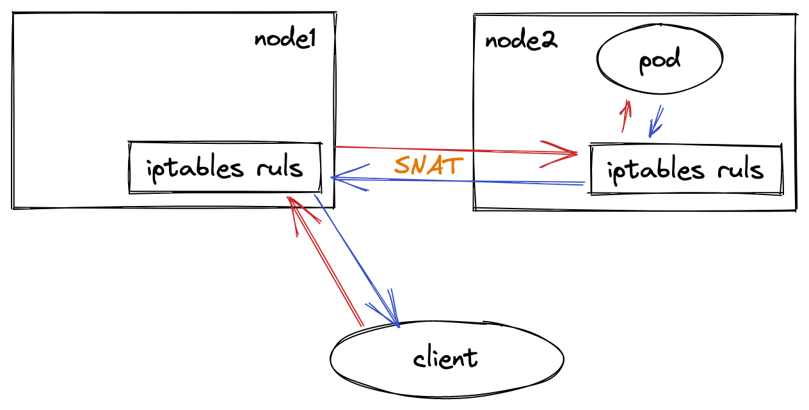

什么是负载均衡
---
负载均衡是高可用架构中的一个关键组件，他可以将请求平摊到后端服务上。

在单副本应用时代，你的服务负载可能并不高，这个时候负载均衡并没有多大用处。当你的应用火爆，用户请求数量多时，你需要将你的服务从单副本转变为多副本，那这个时候，是很有必要引入负载均衡的。

特别是当前微服务盛行的时代，一个应用多副本的高可用形态随处可见，负载均衡已经是个不可或缺的组件了。

Kubernetes中的Service介绍
---
我们知道，Kubernetes中的Pod由于各种原因随时有可能被销毁和新建，且一般应用均以多副本的形式存在。

如果你想要访问一组Pod（或称之为微服务）时，必须有一种抽象资源，能够跟踪到其下所有的Pod，这个抽象便是Service。

Service主要有如下作用：
- 服务发现：动态地将具有相同selector标志的后端Pod绑定起来
- 负载均衡：通过iptables或ipvs的负载均衡算法实现

这里我们主要来讲下Service的负载均衡。

原理
---
从 [官网](https://kubernetes.io/zh/docs/concepts/services-networking/service/#virtual-ips-and-service-proxies) 可知，Service有三种代理模式：

- userspace代理模式
- iptables代理模式
- IPVS代理模式

以iptables模式为例：


可以从图上看到，有一个重要的组件————kube-proxy，它以DaemonSet的形式存在，通过访问apiserver并watch相应资源(Service对象和Endpoint对象)来动态生成各自节点上的iptables规则。

当用户想要访问Pod服务时，iptables会通过NAT(网络地址转化)等方式**随机**请求到任意一个Pod。

在iptables模式下，kube-proxy通过在目标Node节点上的iptables配置中的NAT表的PREROUTIN和POSTROUTING链中创建一系列的自定义链(这些自定义链主要是”KUBE-SERVICE”链， “KUBE-POSTROUTING”链，每个服务对应的”KUBE-SVC-XXXXXX”链和”KUBE-SEP-XXXX”链)，然后通过这些自定义链对流经到该Node的数据包做DNAT和SNAT操作从而实现路由，负载均衡和地址转化。

iptables
---
iptables是Linux平台下的包过滤防火墙，相关的四表五链知识可以去网上学习了解。

当设置了iptables规则后，每个数据包都要通过iptables的过滤，不同流向的数据包会通过不同的链：
- 到本机某进程的报文：PREROUTING --> INPUT
- 由本机转发的报文：PREROUTING --> FORWARD --> POSTROUTING
- 由本机的某进程发出报文：OUTPUT --> POSTROUTING

每个链上会有一些规则去过滤数据包进行操作，这些规则在大体上又可以分为4类，分别存在4张table中：
- filter表：负责过滤功能，防火墙；内核模块：iptables_filter
- nat表：network address translation，网络地址转换功能；内核模块：iptable_nat
- mangle表：拆解报文，做出修改，并重新封装 的功能；内核模块：iptable_mangle
- raw表：关闭nat表上启用的连接追踪机制；内核模块：iptable_raw

实验
---
下面我们来做个实验，具体看下`kube-proxy`生成的`iptables`规则是怎样请求到其中一个`Pod`里的

### 1. 准备

在集群中应用如下创建一个名为nginx-service的Service和副本数为3的nginx Deployment：
```shell
# 创建Deployment
kubectl create deployment nginx --image=nginx --replicas=3
# 创建Service
kubectl expose deployment nginx --port=80 --target-port=80
```
我们可以看到3个Pod的ip分别为:
- 10.244.1.14
- 10.244.1.16
- 10.244.1.17

给Service分配的ip为: 10.97.54.248

```shell
$ kubectl get pod -owide

NAME                     READY   STATUS    RESTARTS   AGE   IP            NODE    NOMINATED NODE   READINESS GATES
busybox                  1/1     Running   0          24s   10.244.1.20   node1   <none>           <none>
nginx-6799fc88d8-8jnxd   1/1     Running   0          39h   10.244.1.14   node1   <none>           <none>
nginx-6799fc88d8-g4d5x   1/1     Running   0          39h   10.244.1.16   node1   <none>           <none>
nginx-6799fc88d8-q45nc   1/1     Running   0          44m   10.244.1.17   node1   <none>           <none>

$ kubectl get svc

NAME         TYPE        CLUSTER-IP     EXTERNAL-IP   PORT(S)   AGE
kubernetes   ClusterIP   10.96.0.1      <none>        443/TCP   175d
nginx-svc    ClusterIP   10.97.54.248   <none>        80/TCP    3m1s
```

我们可以看到nginx Service其下已有一组Endpoint暴露出来，对应的便是3个Pod的ip地址
```shell
$ kubectl describe svc nginx-svc

Name:              nginx-svc
Namespace:         default
Labels:            app=nginx
Annotations:       <none>
Selector:          app=nginx
Type:              ClusterIP
IP Family Policy:  SingleStack
IP Families:       IPv4
IP:                10.97.54.248
IPs:               10.97.54.248
Port:              <unset>  80/TCP
TargetPort:        80/TCP
Endpoints:         10.244.1.14:80,10.244.1.16:80,10.244.1.17:80
Session Affinity:  None
Events:            <none>
```

### 2. ClusterIP
此外，我还建了一个busybox的镜像作为请求的发起方，他的地址是：10.244.1.20

所以当前的请求路径是：10.244.1.20(busybox) --> 10.97.54.248:80(nginx-svc)

根据前文知识（由本机的某进程发出报文），我们先来看主机上的OUTPUT链上的nat表
```shell
root@master:~# iptables -t nat -nvL OUTPUT

Chain OUTPUT (policy ACCEPT 878 packets, 52888 bytes)
 pkts bytes target     prot opt in     out     source               destination
  37M 2597M KUBE-SERVICES  all  --  *      *       0.0.0.0/0            0.0.0.0/0            /* kubernetes service portals */
  11M  673M DOCKER     all  --  *      *       0.0.0.0/0           !127.0.0.0/8          ADDRTYPE match dst-type LOCAL
```
可以看到流量指向了KUBE-SERVICES的链

```shell
root@master:~# iptables -t nat -nvL KUBE-SERVICES
Chain KUBE-SERVICES (2 references)
 pkts bytes target     prot opt in     out     source               destination
    0     0 KUBE-SVC-HL5LMXD5JFHQZ6LN  tcp  --  *      *       0.0.0.0/0            10.97.54.248         /* default/nginx-svc cluster IP */ tcp dpt:80
    0     0 KUBE-SVC-NPX46M4PTMTKRN6Y  tcp  --  *      *       0.0.0.0/0            10.96.0.1            /* default/kubernetes:https cluster IP */ tcp dpt:443
    0     0 KUBE-SVC-TCOU7JCQXEZGVUNU  udp  --  *      *       0.0.0.0/0            10.96.0.10           /* kube-system/kube-dns:dns cluster IP */ udp dpt:53
    0     0 KUBE-SVC-ERIFXISQEP7F7OF4  tcp  --  *      *       0.0.0.0/0            10.96.0.10           /* kube-system/kube-dns:dns-tcp cluster IP */ tcp dpt:53
    0     0 KUBE-SVC-JD5MR3NA4I4DYORP  tcp  --  *      *       0.0.0.0/0            10.96.0.10           /* kube-system/kube-dns:metrics cluster IP */ tcp dpt:9153
 1756  106K KUBE-NODEPORTS  all  --  *      *       0.0.0.0/0            0.0.0.0/0            /* kubernetes service nodeports; NOTE: this must be the last rule in this chain */ ADDRTYPE match dst-type LOCAL
```
由于目标是Service的ip(10.97.54.248)，所以这边又匹配到了KUBE-SVC-HL5LMXD5JFHQZ6LN这条链。

也可以从后面的注释中看到下面需要走哪条链

```shell
root@master:~# iptables -t nat -nvL KUBE-SVC-HL5LMXD5JFHQZ6LN
Chain KUBE-SVC-HL5LMXD5JFHQZ6LN (1 references)
 pkts bytes target     prot opt in     out     source               destination
    0     0 KUBE-MARK-MASQ  tcp  --  *      *      !10.244.0.0/16        10.97.54.248         /* default/nginx-svc cluster IP */ tcp dpt:80
    0     0 KUBE-SEP-U46YXJIMXXUGWXXH  all  --  *      *       0.0.0.0/0            0.0.0.0/0            /* default/nginx-svc */ statistic mode random probability 0.33333333349
    0     0 KUBE-SEP-DUL3TOEKR4Q7XNNH  all  --  *      *       0.0.0.0/0            0.0.0.0/0            /* default/nginx-svc */ statistic mode random probability 0.50000000000
    0     0 KUBE-SEP-OJQRYVIILJUTFXOB  all  --  *      *       0.0.0.0/0            0.0.0.0/0            /* default/nginx-svc */
```
到这里，若源端不是10.244.0.0/16的话，会被打上标记；由于我们的busybox是该网段的，这条规则略过。

然后会随机匹配KUBE-SEP-U46YXJIMXXUGWXXH，KUBE-SEP-DUL3TOEKR4Q7XNNH，KUBE-SEP-OJQRYVIILJUTFXOB这三条链的其中一条。

其意思是：会有1/3的概率命中KUBE-SEP-U46YXJIMXXUGWXXH这条链，如果没命中的话，会有2/3 * 1/2 = 1/3 的概率命中第二条链KUBE-SEP-DUL3TOEKR4Q7XNNH，最后还有1/3的概率命中最后一条链KUBE-SEP-OJQRYVIILJUTFXOB。

可以看出，这边是在做负载均衡。

我们选择其中一条链KUBE-SEP-U46YXJIMXXUGWXXH继续走下去
```shell
root@master:~# iptables -t nat -nvL KUBE-SEP-U46YXJIMXXUGWXXH
Chain KUBE-SEP-U46YXJIMXXUGWXXH (1 references)
 pkts bytes target     prot opt in     out     source               destination
    0     0 KUBE-MARK-MASQ  all  --  *      *       10.244.1.14          0.0.0.0/0            /* default/nginx-svc */
    0     0 DNAT       tcp  --  *      *       0.0.0.0/0            0.0.0.0/0            /* default/nginx-svc */ tcp to:10.244.1.14:80
```
KUBE-MARK-MASQ自己Pod内访问，打上标记，可以先不看。

看DNAT那条链，可以看到这里做了目标地址转化，最终我们的请求从：
10.244.1.20(busybox) --> 10.97.54.248:80(nginx-svc)
变成了
10.244.1.20(busybox) --> 10.244.1.14:80(nginx-6799fc88d8-8jnxd)

OUTPUT链走完之后还会经过POSTROUTING链：
```shell
root@master:~# iptables -t nat -nvL POSTROUTING
Chain POSTROUTING (policy ACCEPT 5321 packets, 321K bytes)
 pkts bytes target     prot opt in     out     source               destination
  41M 2939M KUBE-POSTROUTING  all  --  *      *       0.0.0.0/0            0.0.0.0/0            /* kubernetes postrouting rules */
    0     0 MASQUERADE  all  --  *      !docker0  172.17.0.0/16        0.0.0.0/0
6994K  525M RETURN     all  --  *      *       10.244.0.0/16        10.244.0.0/16
 758K   67M MASQUERADE  all  --  *      *       10.244.0.0/16       !224.0.0.0/4          random-fully
    0     0 RETURN     all  --  *      *      !10.244.0.0/16        10.244.0.0/24
    0     0 MASQUERADE  all  --  *      *      !10.244.0.0/16        10.244.0.0/16        random-fully
root@master:~# iptables -t nat -nvL KUBE-POSTROUTING
Chain KUBE-POSTROUTING (1 references)
 pkts bytes target     prot opt in     out     source               destination
 5396  325K RETURN     all  --  *      *       0.0.0.0/0            0.0.0.0/0            mark match ! 0x4000/0x4000
    0     0 MARK       all  --  *      *       0.0.0.0/0            0.0.0.0/0            MARK xor 0x4000
    0     0 MASQUERADE  all  --  *      *       0.0.0.0/0            0.0.0.0/0            /* kubernetes service traffic requiring SNAT */ random-fully
```
KUBE-POSTROUTING会对数据包进行判断，如果发现它有0x4000/0x4000标记，就会跳到MASQUERADE规则，由于我们并没有被打上标记，直接RETURN。


### 3. NodePort

NodePort是集群外访问集群内服务的一种方式，从iptables规则来看，NodePort是ClusterIP的超集，额外比ClusterIP多了一些规则。

现在我把原来的ClusterIP删了之后创建了一个名为nginx-svc-nodeport的NodePort类型的service。

```shell
zjq@master:~$ kubectl get svc

NAME                 TYPE        CLUSTER-IP       EXTERNAL-IP   PORT(S)        AGE
kubernetes           ClusterIP   10.96.0.1        <none>        443/TCP        175d
nginx-svc-nodeport   NodePort    10.109.235.134   <none>        80:31082/TCP   10s
```
该Service对集群外暴露的端口是31082，这个端口是由每个节点上的kube-proxy打开的，可以用如下命令查看：
```shell
root@master:~# netstat -anp | grep 31082
tcp        0      0 0.0.0.0:31082           0.0.0.0:*               LISTEN      1231199/kube-proxy

root@node1:~# netstat -anp | grep 31082
tcp        0      0 0.0.0.0:31082           0.0.0.0:*               LISTEN      1986768/kube-proxy
```
这样，你便能通过任意节点+port的方式访问到微服务了。

现在我们来看下NodePort类型的iptables。

```shell
root@master:~# iptables -t nat -nvL PREROUTING
Chain PREROUTING (policy ACCEPT 20 packets, 980 bytes)
 pkts bytes target     prot opt in     out     source               destination
6621K  791M KUBE-SERVICES  all  --  *      *       0.0.0.0/0            0.0.0.0/0            /* kubernetes service portals */
2918K  426M DOCKER     all  --  *      *       0.0.0.0/0            0.0.0.0/0            ADDRTYPE match dst-type LOCAL
```

```shell
root@master:~# iptables -t nat -nvL KUBE-SERVICES
Chain KUBE-SERVICES (2 references)
 pkts bytes target     prot opt in     out     source               destination
    0     0 KUBE-SVC-XKWTKZBTDCMU3FHC  tcp  --  *      *       0.0.0.0/0            10.109.235.134       /* default/nginx-svc-nodeport cluster IP */ tcp dpt:80
    0     0 KUBE-SVC-NPX46M4PTMTKRN6Y  tcp  --  *      *       0.0.0.0/0            10.96.0.1            /* default/kubernetes:https cluster IP */ tcp dpt:443
    0     0 KUBE-SVC-TCOU7JCQXEZGVUNU  udp  --  *      *       0.0.0.0/0            10.96.0.10           /* kube-system/kube-dns:dns cluster IP */ udp dpt:53
    0     0 KUBE-SVC-ERIFXISQEP7F7OF4  tcp  --  *      *       0.0.0.0/0            10.96.0.10           /* kube-system/kube-dns:dns-tcp cluster IP */ tcp dpt:53
    0     0 KUBE-SVC-JD5MR3NA4I4DYORP  tcp  --  *      *       0.0.0.0/0            10.96.0.10           /* kube-system/kube-dns:metrics cluster IP */ tcp dpt:9153
 1978  119K KUBE-NODEPORTS  all  --  *      *       0.0.0.0/0            0.0.0.0/0            /* kubernetes service nodeports; NOTE: this must be the last rule in this chain */ ADDRTYPE match dst-type LOCAL
```
从上述看到，会先跳转掉KUBE-NODEPORTS这条链，来看下KUBE-NODEPORTS这条链之后的路径
```shell
root@master:~# iptables -t nat -nvL KUBE-NODEPORTS
Chain KUBE-NODEPORTS (1 references)
 pkts bytes target     prot opt in     out     source               destination
    0     0 KUBE-SVC-XKWTKZBTDCMU3FHC  tcp  --  *      *       0.0.0.0/0            0.0.0.0/0            /* default/nginx-svc-nodeport */ tcp dpt:31082
```
```shell
root@master:~# iptables -t nat -nvL KUBE-SVC-XKWTKZBTDCMU3FHC
Chain KUBE-SVC-XKWTKZBTDCMU3FHC (2 references)
 pkts bytes target     prot opt in     out     source               destination
    0     0 KUBE-MARK-MASQ  tcp  --  *      *      !10.244.0.0/16        10.109.235.134       /* default/nginx-svc-nodeport cluster IP */ tcp dpt:80
    0     0 KUBE-MARK-MASQ  tcp  --  *      *       0.0.0.0/0            0.0.0.0/0            /* default/nginx-svc-nodeport */ tcp dpt:31082
    0     0 KUBE-SEP-VLHANZGCXJXNRTPY  all  --  *      *       0.0.0.0/0            0.0.0.0/0            /* default/nginx-svc-nodeport */ statistic mode random probability 0.33333333349
    0     0 KUBE-SEP-L66MBC5WQIY6TV6O  all  --  *      *       0.0.0.0/0            0.0.0.0/0            /* default/nginx-svc-nodeport */ statistic mode random probability 0.50000000000
    0     0 KUBE-SEP-EAEOYSPXP66WOJLO  all  --  *      *       0.0.0.0/0            0.0.0.0/0            /* default/nginx-svc-nodeport */
```
先会匹配到第二个KUBE-MARK-MASQ链，用于打上标记(之后有用)。

再往下，通过随机负载均衡和ClusterIP的逻辑一致。

这里需要注意的一点是，这时候执行KUBE-POSTROUTING链时，由于匹配到之前做的标记0x4000，会做一个SNAT操作。

为什么要做SNAT转化呢？这边假设一个场景，如下图：



当一个外部的client通过node2的地址访问一个Service的时候，node2上的负载均衡规则，就可能把这个IP包转发给一个在node1上的Pod。这里没有任何问题。

而当node1上的这个Pod处理完请求之后，它就会按照这个IP包的源地址发出回复。

可是，如果没有做SNAT操作的话，这时候，被转发来的IP包的源地址就是client的IP地址。所以此时，Pod就会直接将回复发给client。对于client来说，它的请求明明发给了node2，收到的回复却来自node1，这个client很可能会报错。

### 4. LoadBalance
LoadBalance是NodePort的超集，这边不再分析。

原理分析
---
通过分析kube-proxy的实现能够更好地理解Service的实现。

新建proxyServer对象newProxyServer方法，会根据不同的模式来初始化proxier对象。

如果你的节点未开启ipvs，则自动降级为iptables模式。

```go
func newProxyServer(
config *proxyconfigapi.KubeProxyConfiguration,
cleanupAndExit bool,
master string) (*ProxyServer, error) {
	...
	if proxyMode == proxyModeIPTables {
        klog.V(0).InfoS("Using iptables Proxier")
        ...
        if dualStack {
            ...
            // TODO this has side effects that should only happen when Run() is invoked.
            proxier, err = iptables.NewDualStackProxier(
            ipt,
            utilsysctl.New(),
            execer,
            config.IPTables.SyncPeriod.Duration,
            config.IPTables.MinSyncPeriod.Duration,
            config.IPTables.MasqueradeAll,
            int(*config.IPTables.MasqueradeBit),
            localDetectors,
            hostname,
            nodeIPTuple(config.BindAddress),
            recorder,
            healthzServer,
            config.NodePortAddresses,
            )
        } else {
			...
            // TODO this has side effects that should only happen when Run() is invoked.
            proxier, err = iptables.NewProxier(
                iptInterface,
                utilsysctl.New(),
                execer,
                config.IPTables.SyncPeriod.Duration,
                config.IPTables.MinSyncPeriod.Duration,
                config.IPTables.MasqueradeAll,
                int(*config.IPTables.MasqueradeBit),
                localDetector,
                hostname,
                nodeIP,
                recorder,
                healthzServer,
                config.NodePortAddresses,
            )
        }
        
        if err != nil {
        return nil, fmt.Errorf("unable to create proxier: %v", err)
        }
        proxymetrics.RegisterMetrics()
    } else if proxyMode == proxyModeIPVS {
		...
		klog.V(0).InfoS("Using ipvs Proxier")
    } else {
		...
        klog.V(0).InfoS("Using userspace Proxier")
    }
}
```

ProxyServer结构体最主要的是Run()方法：
```go
func (s *ProxyServer) Run() error {
	...
    // 暴露/healthz接口
    // Start up a healthz server if requested
    serveHealthz(s.HealthzServer, errCh)
    
    // 暴露指标信息
    // Start up a metrics server if requested
    serveMetrics(s.MetricsBindAddress, s.ProxyMode, s.EnableProfiling, errCh)
	
	...
    // 新建informerFactory
    // Make informers that filter out objects that want a non-default service proxy.
    informerFactory := informers.NewSharedInformerFactoryWithOptions(s.Client, s.ConfigSyncPeriod,
        informers.WithTweakListOptions(func(options *metav1.ListOptions) {
        options.LabelSelector = labelSelector.String()
        }))
    
    // kube-proxy主要watch了service和endpoint(或endpointSlices)资源的变动，
    // 当它们有变动时，对应节点上的iptables规则也会相相应地变动
    // Create configs (i.e. Watches for Services and Endpoints or EndpointSlices)
    // Note: RegisterHandler() calls need to happen before creation of Sources because sources
    // only notify on changes, and the initial update (on process start) may be lost if no handlers
    // are registered yet.
    serviceConfig := config.NewServiceConfig(informerFactory.Core().V1().Services(), s.ConfigSyncPeriod)
    serviceConfig.RegisterEventHandler(s.Proxier)
    go serviceConfig.Run(wait.NeverStop)
    
    if endpointsHandler, ok := s.Proxier.(config.EndpointsHandler); ok && !s.UseEndpointSlices {
        endpointsConfig := config.NewEndpointsConfig(informerFactory.Core().V1().Endpoints(), s.ConfigSyncPeriod)
        endpointsConfig.RegisterEventHandler(endpointsHandler)
        go endpointsConfig.Run(wait.NeverStop)
    } else {
        endpointSliceConfig := config.NewEndpointSliceConfig(informerFactory.Discovery().V1().EndpointSlices(), s.ConfigSyncPeriod)
        endpointSliceConfig.RegisterEventHandler(s.Proxier)
        go endpointSliceConfig.Run(wait.NeverStop)
    }
    
    // 启动informer
    // This has to start after the calls to NewServiceConfig and NewEndpointsConfig because those
    // functions must configure their shared informer event handlers first.
    informerFactory.Start(wait.NeverStop)
	
    ...
    // Birth Cry after the birth is successful
    s.birthCry()
    
    // 进入定时循环
    go s.Proxier.SyncLoop()

    return <-errCh
}
```
这里我们来看下serviceConfig中的Run()方法，这里面根据注册的eventHandlers动作，均会执行OnServiceSynced()方法，

```go
// Run waits for cache synced and invokes handlers after syncing.
func (c *ServiceConfig) Run(stopCh <-chan struct{}) {
    klog.InfoS("Starting service config controller")
    
    if !cache.WaitForNamedCacheSync("service config", stopCh, c.listerSynced) {
        return
    }
    
    for i := range c.eventHandlers {
        klog.V(3).InfoS("Calling handler.OnServiceSynced()")
        // 注册的事件动作执行相应的OnServiceSynced()
        c.eventHandlers[i].OnServiceSynced()
    }
}
```

在OnServiceSynced中，我们可以看到核心方法syncProxyRules()

在十分冗长的syncProxyRules方法中(大约800行)，里面就会应用iptables rule到当前的节点。
```go
// OnServiceSynced is called once all the initial event handlers were
// called and the state is fully propagated to local cache.
func (proxier *Proxier) OnServiceSynced() {
    proxier.mu.Lock()
    proxier.servicesSynced = true
    proxier.setInitialized(proxier.endpointSlicesSynced)
    proxier.mu.Unlock()
    
    // Sync unconditionally - this is called once per lifetime.
    // 应用iptables rule到节点上
    proxier.syncProxyRules()
}
```

结论
---
本文简单介绍了负载均衡的作用和Kubernetes中负载均衡的原理，并通过一些实验例子来展示请求是如何被转发到Pod中的，最后通过分析核心源码的方式来了解具体实现。

但是，iptables也存在许多问题：

1. iptables规则多了之后性能下降。按照 [官方说法](https://kubernetes.io/blog/2018/07/09/ipvs-based-in-cluster-load-balancing-deep-dive/#why-ipvs-for-kubernetes):
> 尽管 Kubernetes 在版本1.6中已经支持5000个节点，但是使用 iptables 的 kube-proxy 实际上是将集群扩展到5000个节点的一个瓶颈。一个例子是在一个包含5000个节点的集群中使用 NodePort Service，如果我们有2000个服务，每个服务有10个 pods，这将导致每个工作节点上至少有20000个 iptable 记录，这会使内核非常繁忙。

2. iptables使用的负载均衡算法简单，不支持复杂场景。相反，ipvs能够支持更多的负载均衡算法，且性能更好

另外，基于eBPF技术实现的CNI插件cilium可以完全替换kube-proxy，感兴趣的同学可以试一下。
