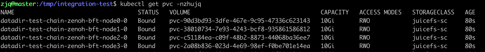
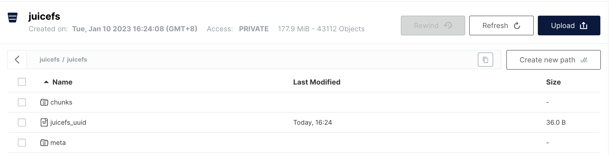

对象存储与生态
---
说起对象存储，不得不提Amazon的AWS S3(Simple Storage Service).

进入到21世纪，数据急剧增长，当时已经是电商巨头的Amazon需要一种海量的、可扩展的、支持非结构化数据且对开发友好的网络存储。2006年，S3云服务应运而生。

从那之后，各个云厂商也随之跟进，发布了自己的对象存储服务。

S3也不仅仅代表了一种云服务，也成为了对象存储业界的一种协议。

当前，很多云产品也都构建在S3之上，围绕对象存储基础设施，构建了庞大的生态。除了云商巨头，像Snowflake、Databricks这些明星data infra公司，更是离不开对象存储。

国内近年来也有基于对象存储创业的公司，如兼容S3协议的JuiceFS，新式云仓Databend。

从最几年的趋势来看，S3或者说对象存储俨然已经成为云上数据湖的基础。

使用JuiceFS让CITA-Cloud跑在对象存储上
---
对象存储普遍用于存放图片、音视频等静态文件。

那么，既然作为存储的一种，CITA-Cloud能否直接运行在对象存储之上，而不占用本地空间呢？答案是肯定的，下面我们演示下怎么使用JuiceFS让CITA-Cloud跑在对象存储上。

### JuiceFS简介与使用
JuiceFS是为云环境设计，兼容 POSIX、HDFS 和 S3 协议的分布式文件系统，具体介绍可以查看[官网](https://juicefs.com/zh-cn/)

在我看来，JuiceFS能让对象存储上的一个Bucket变成一块大的云盘，挂载在本地，让应用能像读取本地文件一样来操作对象存储上的对象。

JuiceFS主要分为三部分：JuiceFS客户端、数据存储(公有云对象存储/MinIO等)、元数据引擎(Redis/SQLite等)。

这里我们使用Redis作为元数据引擎。JuiceFS提供了针对Kubernetes环境的CSI，并提供了Helm的安装方式。

JuiceFS安装时需要一个存储来保存对应文件系统的元数据，这里我们使用Redis；后端对象存储使用MinIO。

Helm安装时的配置如下：
```shell
storageClasses:
- # -- `StorageClass` Name. It is important.
  name: juicefs-sc
  # -- Default is `true` will create a new `StorageClass`. It will create `Secret` and `StorageClass` used by CSI Driver.
  enabled: true
  # -- Either `Delete` or `Retain`. Refer to [this document](https://juicefs.com/docs/csi/guide/resource-optimization#reclaim-policy) for more information.
  reclaimPolicy: Delete
  # -- Additional annotations for this `StorageClass`, e.g. make it default.
  # annotations:
  #   storageclass.kubernetes.io/is-default-class: "true"
  backend:
    # -- The JuiceFS file system name
    name: "juicefs"
    # -- Connection URL for metadata engine (e.g. Redis), for community edition use only. Refer to [this document](https://juicefs.com/docs/community/databases_for_metadata) for more information.
    metaurl: "redis://:123456@redis-service.default:6379/1"
    # -- Object storage type, such as `s3`, `gs`, `oss`, for community edition use only. Refer to [this document](https://juicefs.com/docs/community/how_to_setup_object_storage) for the full supported list.
    storage: "minio"
    # -- Bucket URL, for community edition use only. Refer to [this document](https://juicefs.com/docs/community/how_to_setup_object_storage) to learn how to setup different object storage.
    bucket: "http://minio.zhujq:9000/juicefs"
    # -- JuiceFS managed token, for cloud service use only. Refer to [this document](https://juicefs.com/docs/cloud/acl) for more details.
    token: ""
    # -- Access key for object storage
    accessKey: "minio"
    # -- Secret key for object storage
    secretKey: "minio123"
```

安装完成之后，可以看到多了一个名为`juicefs-sc`的StorageClass，在我的集群中如下所示：


### 创建一条链
有了相应的StorageClass，我们可以用Cloud-Config来创建一条链，创建时指定StorageClass参数为juicefs-sc。

可以看到一条4个节点的链已经运行起来了，并且能正常出块：

同时创建了对应的PVC:



在MinIO界面上，我们能看到对应的名为juice的bucket被创建，链节点的数据文件被分割为多个chunk进行存储：



结语
---
对象存储作为一种相对廉价的海量存储，在强调降本增效的今天来看，越来越能体现它的重要性。

当然，上面的例子只是一个实验，想要在生产环境使用，需要做完善的测试和评估，相信将来会有更多能与对象存储一起结合的场景。