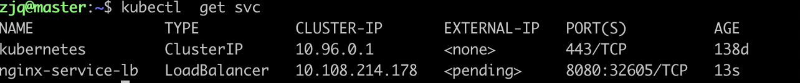
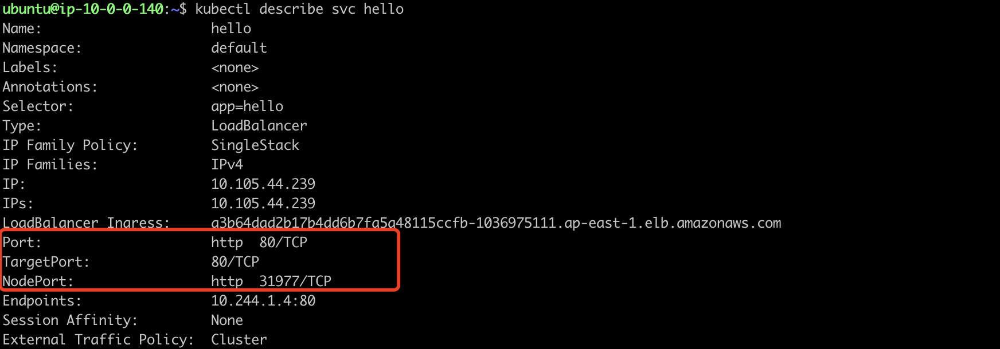
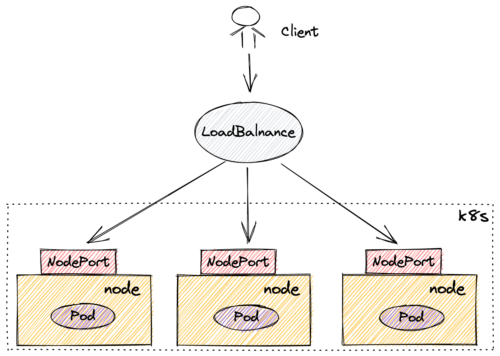

Service的分类
---
在Kubernetes中，经常用到的有这些类型的Service：ClusterIP，NodePort，LoadBalancer

### ClusterIP
ClusterIP主要用来集群内应用的互相访问，比如你有个数据库服务暴露了一个名为db-service的Service ，那么你的应用可以使用如下的方式连接：
```shell
# <service>.<namespace>:<service-port>
spring.datasource.url=jdbc:mysql://db-service.default:3306/test?characterEncoding=utf8&useSSL=true
```

### NodePort
NodePort为我们给集群外暴露服务提供了一种方式。NodePort顾名思义，这种Service在每个Kubernetes的节点暴露一个Port(默认为30000-32767)。

注意，这里是每个节点都会暴露一个Port。

所以，你可以在集群外所用任意节点的IP+Port连接到集群内的服务。

一般情况下，这种方式只会在测试阶段使用，所以不建议在生产环境中使用NodePort方式对外暴露服务，有如下缺点：

- 端口范围有限制，只能是30000-32767 
- 直接对外暴露云主机的IP并不安全 
- 由于客户端固定使用其中一个云主机实例的IP连接，若该云主机故障，则整个多副本应用都不能对外提供服务，除非自己在客户端层面实现故障检测机制。 
- 一些厂商的云主机的公有IP会变，如AWS的EC2，关闭后再重启，可能导致IP不一致

### LoadBalancer
为解决以上问题，传统云环境下，我们都会用云厂商的LoadBalancer来实现负载均衡和服务的高可用。如：AWS的ELB，阿里云的SLB等。顾名思义，LoadBalancer可以将流量导入后端多个实例，实现请求服务的负载均衡。

Kubernetes作为云原生时代的基础设施，必然会用到一些公有云资源，如LoadBalancer、云盘等，来适应云环境下的各种场景（当然私有云环境也会有与公有云相对应的资源或服务，这里不在讨论范围）。

Kubernetes中的LoadBalancer类型的Service为我们创建云上LoadBalancer的服务提供了便利，你可以使用如下配置：

```yaml
apiVersion: v1
kind: Service
metadata:
  name: nginx-service-lb
spec:
  type: LoadBalancer
  selector:
    app: nginx-net
  ports:
    - protocol: TCP
      port: 8080
      targetPort: 80
```
如上，我在我自己的集群上使用了名为nginx-service-lb的LoadBalancer类型的Service来暴露后端的Nginx服务。不过会遇到如下错误状态:


可以看到，nginx-service-lb会一直处于pending状态。不过，仔细一想也会知道，我的自建集群并未告知Kubernetes相关云服务的账号信息，怎么会为我们创建对应的云资源呢。

Cloud Provider与Cloud Controller Manager
---
其实，在Kubernetes创建公有云资源，还需要告诉Kubernetes所处于的云环境，Kubernetes把创建云资源的事交给了叫做Cloud Provider或Cloud Controller Manager的组件来做。

以上提及的组件存在两种形式：

- in-tree方式：Kubernetes v1.6之前的做法，也就是Cloud Provider。该方式各Providers的代码集成在Kubernetes主代码中，各核心组件通过--cloud-provider参数来启动对应的Provider（如AWS/Azure/GCE等），由于和Kubernetes代码耦合，当前这种方法已被官方弃用。
- out-of-tree方式：需要在集群中安装一个独立组件，也叫Cloud Controller Manager，并通过设置--cloud-provider=external的方式来告诉各核心组件通过外部组件来完成云资源的创建和管理，如AWS的 [cloud-provider-aws](https://github.com/kubernetes/cloud-provider-aws) ，阿里云的 [cloud-provider-alibaba-cloud](https://github.com/kubernetes/cloud-provider-alibaba-cloud) ，它们均被托管在Kubernetes官方仓库下。这种方式独立于Kubernetes核心代码的开发、构建和发布，是官方推荐的做法。

### In-tree方式的Cloud Provider初始化分析

> 虽说已弃用，但又不是不能用

现在，我在AWS的EC2实例上自建了Kubernetes集群，并在初始化集群的时候设置--cloud-provider=aws参数（in-tree方式，生产环境并不建议用，此处做实验用）来告诉Kubernetes初始化AWS的Provider:
```yaml
# 你可以使用kubeadm init --config=如下配置来初始化集群
apiVersion: kubeadm.k8s.io/v1beta3
bootstrapTokens:
- groups:
  - system:bootstrappers:kubeadm:default-node-token
  token: abcdef.0123456789abcdef
  ttl: 24h0m0s
  usages:
  - signing
  - authentication
kind: InitConfiguration
localAPIEndpoint:
  advertiseAddress: 10.0.0.216
  bindPort: 6443
nodeRegistration:
  criSocket: /var/run/dockershim.sock
  imagePullPolicy: IfNotPresent
  name: ip-10-0-0-216.ap-east-1.compute.internal
  taints: null
  kubeletExtraArgs:
    cloud-provider: "aws"
---
apiServer:
  timeoutForControlPlane: 4m0s
  extraArgs:
    cloud-provider: "aws"
apiVersion: kubeadm.k8s.io/v1beta3
certificatesDir: /etc/kubernetes/pki
clusterName: kubernetes
controllerManager:
  extraArgs:
    cloud-provider: "aws"
dns: {}
etcd:
  local:
    dataDir: /var/lib/etcd
imageRepository: k8s.gcr.io
kind: ClusterConfiguration
kubernetesVersion: 1.23.0
networking:
  dnsDomain: cluster.local
  serviceSubnet: 10.96.0.0/12
  podSubnet: 10.244.0.0/16
scheduler: {}
---
kind: KubeletConfiguration
apiVersion: kubelet.config.k8s.io/v1beta1
cgroupDriver: cgroupfs
```

我们可以在Kubernetes的代码中(以v1.23.3为例)看到初始化Cloud Provider的相关逻辑：
```go
func createCloudProvider(cloudProvider string, externalCloudVolumePlugin string, cloudConfigFile string,
                         allowUntaggedCloud bool, sharedInformers informers.SharedInformerFactory) (cloudprovider.Interface, ControllerLoopMode, error) {
    var cloud cloudprovider.Interface
    var loopMode ControllerLoopMode
    var err error
    
    if utilfeature.DefaultFeatureGate.Enabled(features.DisableCloudProviders) && cloudprovider.IsDeprecatedInternal(cloudProvider) {
        cloudprovider.DisableWarningForProvider(cloudProvider)
        return nil, ExternalLoops, fmt.Errorf(
            "cloud provider %q was specified, but built-in cloud providers are disabled. Please set --cloud-provider=external and migrate to an external cloud provider",
            cloudProvider)
    }
    // 判断是否是external参数
    if cloudprovider.IsExternal(cloudProvider) {
        loopMode = ExternalLoops
        if externalCloudVolumePlugin == "" {
            // externalCloudVolumePlugin is temporary until we split all cloud providers out.
            // So we just tell the caller that we need to run ExternalLoops without any cloud provider.
            return nil, loopMode, nil
        }
        cloud, err = cloudprovider.InitCloudProvider(externalCloudVolumePlugin, cloudConfigFile)
    } else {
        // 输出弃用信息
        cloudprovider.DeprecationWarningForProvider(cloudProvider)
        
        loopMode = IncludeCloudLoops
        // 初始化相应的云厂商provider
        cloud, err = cloudprovider.InitCloudProvider(cloudProvider, cloudConfigFile)
    }
    if err != nil {
        return nil, loopMode, fmt.Errorf("cloud provider could not be initialized: %v", err)
    }
    
    if cloud != nil && !cloud.HasClusterID() {
        if allowUntaggedCloud {
            klog.Warning("detected a cluster without a ClusterID.  A ClusterID will be required in the future.  Please tag your cluster to avoid any future issues")
        } else {
            return nil, loopMode, fmt.Errorf("no ClusterID Found.  A ClusterID is required for the cloud provider to function properly.  This check can be bypassed by setting the allow-untagged-cloud option")
        }
    }
    // 设置Informoer
    if informerUserCloud, ok := cloud.(cloudprovider.InformerUser); ok {
        informerUserCloud.SetInformers(sharedInformers)
    }
    return cloud, loopMode, err
}
```

创建LoadBalancer
---
现在我们可以在集群中创建Nginx的Deployment和Service:
```yaml
kind: Service
apiVersion: v1
metadata:
  name: hello
spec:
  type: LoadBalancer
  selector:
    app: hello
  ports:
    - name: http
      protocol: TCP
      targetPort: 80
      # ELB's port
      port: 80
---
apiVersion: apps/v1
kind: Deployment
metadata:
  name: hello
spec:
  replicas: 1
  selector:
    matchLabels:
      app: hello
  template:
    metadata:
      labels:
        app: hello
    spec:
      containers:
        - name: hello
          image: nginx
```

你可以在的控制台上看到，一个LoadBalancer资源被自动创建了，且负载均衡的80端口对应的后端实例端口为31977。


我们再来看下刚才创建的LoadBalancer Service：




和NodePort的Service类似，LoadBalancer类型的Service也会有一个NodePort端口暴露，这块的逻辑对于这两种Service是一样的，也就是kube-proxy在每个节点开放了31977这个端口，这里不在赘述。

登录浏览器，你可以使用External-IP访问到Nginx主页面。

以上，我们通过创建LoadBalancer类型的Service来暴露我们集群内部的服务。创建LoadBalancer时Kubernetes主要为我们做了这些事情：

- 在所有节点上开放一个相同的端口，并做流量的负载均衡（由kube-proxy完成）
- 自动为我们创建云上LoadBalancer资源，并且完成对应的实例端口映射（由service-controller完成）

源码分析
---
Cloud Provider中的service-controller的新建代码:
```go
// New returns a new service controller to keep cloud provider service resources
// (like load balancers) in sync with the registry.
func New(
	cloud cloudprovider.Interface,
	kubeClient clientset.Interface,
	serviceInformer coreinformers.ServiceInformer,
	nodeInformer coreinformers.NodeInformer,
	clusterName string,
	featureGate featuregate.FeatureGate,
) (*Controller, error) {
	broadcaster := record.NewBroadcaster()
	broadcaster.StartStructuredLogging(0)
	broadcaster.StartRecordingToSink(&v1core.EventSinkImpl{Interface: kubeClient.CoreV1().Events("")})
	recorder := broadcaster.NewRecorder(scheme.Scheme, v1.EventSource{Component: "service-controller"})

	if kubeClient != nil && kubeClient.CoreV1().RESTClient().GetRateLimiter() != nil {
		if err := ratelimiter.RegisterMetricAndTrackRateLimiterUsage(subSystemName, kubeClient.CoreV1().RESTClient().GetRateLimiter()); err != nil {
			return nil, err
		}
	}

	registerMetrics()
	s := &Controller{
		cloud:            cloud,
		knownHosts:       []*v1.Node{},
		kubeClient:       kubeClient,
		clusterName:      clusterName,
		cache:            &serviceCache{serviceMap: make(map[string]*cachedService)},
		eventBroadcaster: broadcaster,
		eventRecorder:    recorder,
		nodeLister:       nodeInformer.Lister(),
		nodeListerSynced: nodeInformer.Informer().HasSynced,
		queue:            workqueue.NewNamedRateLimitingQueue(workqueue.NewItemExponentialFailureRateLimiter(minRetryDelay, maxRetryDelay), "service"),
		// nodeSyncCh has a size 1 buffer. Only one pending sync signal would be cached.
		nodeSyncCh: make(chan interface{}, 1),
	}

	serviceInformer.Informer().AddEventHandlerWithResyncPeriod(
		cache.ResourceEventHandlerFuncs{
            // 添加事件回调函数
			AddFunc: func(cur interface{}) {
				svc, ok := cur.(*v1.Service)
				// Check cleanup here can provide a remedy when controller failed to handle
				// changes before it exiting (e.g. crashing, restart, etc.).
				if ok && (wantsLoadBalancer(svc) || needsCleanup(svc)) {
					s.enqueueService(cur)
				}
			},
            // 更新事件回调函数
			UpdateFunc: func(old, cur interface{}) {
				oldSvc, ok1 := old.(*v1.Service)
				curSvc, ok2 := cur.(*v1.Service)
				if ok1 && ok2 && (s.needsUpdate(oldSvc, curSvc) || needsCleanup(curSvc)) {
					s.enqueueService(cur)
				}
			},
			// No need to handle deletion event because the deletion would be handled by
			// the update path when the deletion timestamp is added.
		},
		serviceSyncPeriod,
	)
	s.serviceLister = serviceInformer.Lister()
	s.serviceListerSynced = serviceInformer.Informer().HasSynced

	...

	if err := s.init(); err != nil {
		return nil, err
	}

	return s, nil
}

// LoadBalance类型
func wantsLoadBalancer(service *v1.Service) bool {
	// if LoadBalancerClass is set, the user does not want the default cloud-provider Load Balancer
	return service.Spec.Type == v1.ServiceTypeLoadBalancer && service.Spec.LoadBalancerClass == nil
}
```

可以看到，在Cloud Provider中的serviceInformer只关注了LoadBalancer类型的Service的动作事件。当相对应的事件入队时，控制循环会执行相应的调谐逻辑。

客户端到我们的业务实例请求流程如下：


结语
---
本文简单介绍了暴露服务的主要几种方式，并着重介绍了Cloud Provider，并通过AWS的Cloud Provider创建了一个LoadBalancer。当然还有以下要注意的点：

- LoadBalancer是Kubernetes在NodePort类型Service上的功能加成，他们的基础均是ClusterIP
- 公有云上的容器服务一般都会使用自家的out-of-tree的cloud-controller-manager组件
- 微服务架构下，每个服务使用都使用一个LoadBalancer反而带来了额外的开销和管理成本，可以搭配Ingress等7层LoadBalancer一起使用